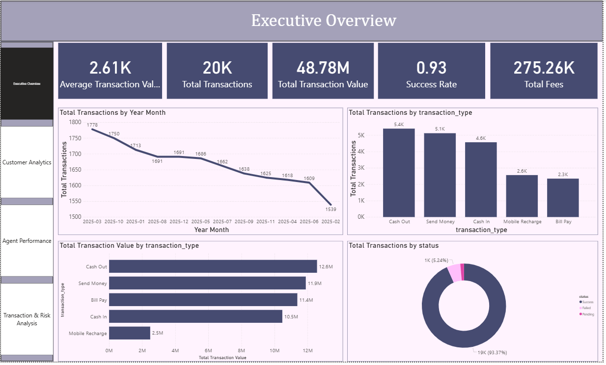
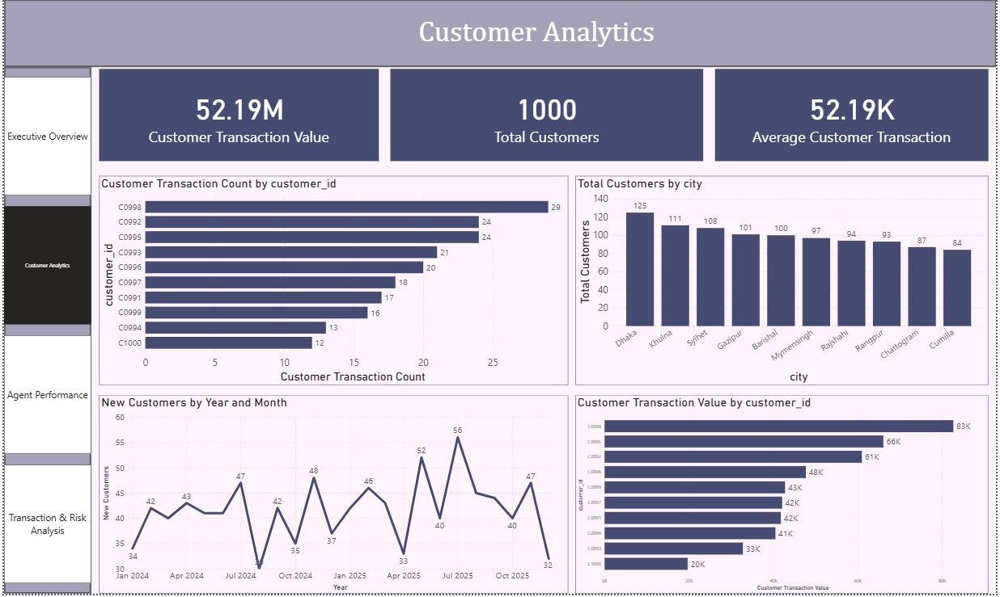
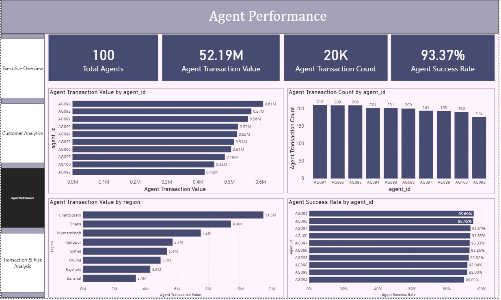
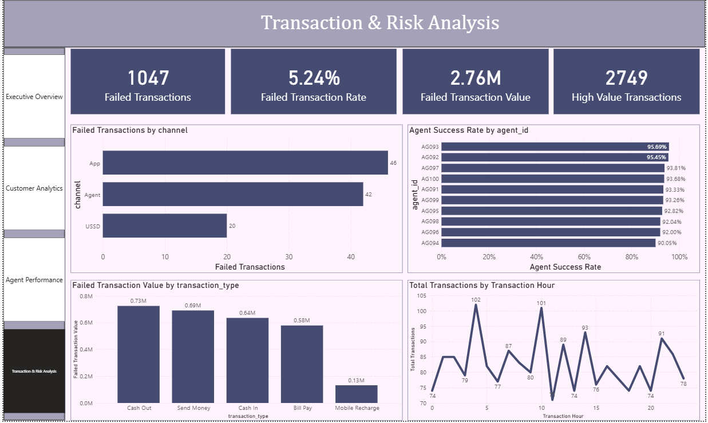

# MFS Transaction Analysis

> An end-to-end data analytics project analyzing Mobile Financial Services (MFS) transactions, customer behavior, agent performance, and transaction trends using Python, SQL, Supabase PostgreSQL, and Power BI.

## 📌 Overview

This project demonstrates a complete data analytics workflow, starting from raw MFS transaction data and transforming it into meaningful business insights.

The project covers:

- Data cleaning and validation using Python
- Relational database management using Supabase PostgreSQL
- Business analysis using SQL
- Data modeling and DAX using Power BI
- Interactive dashboard development
- Business insight generation

### Project Workflow

```text
Raw Data
    ↓
Python Data Cleaning
    ↓
Supabase PostgreSQL
    ↓
SQL Analysis
    ↓
Power BI Data Modeling
    ↓
DAX Measures
    ↓
Interactive Dashboard
    ↓
Business Insights
```

## 🎯 Objectives

The main objectives of this project are:

- Analyze MFS transaction performance
- Understand customer transaction behavior
- Analyze transaction types
- Monitor successful and failed transactions
- Evaluate agent performance
- Identify high-value customers and transactions
- Analyze monthly transaction trends
- Identify transaction failure patterns
- Generate actionable business insights

## 🛠️ Technologies Used

| Technology | Purpose |
|---|---|
| Python | Data cleaning and preprocessing |
| Pandas | Data manipulation and transformation |
| NumPy | Numerical analysis |
| SQL | Business and transactional analysis |
| Supabase | PostgreSQL database and cloud data storage |
| Power BI | Data visualization and dashboard development |
| DAX | KPI and analytical calculations |
| GitHub | Version control and documentation |


# 🧹 Data Cleaning with Python

Python and Pandas were used to clean, validate, and prepare the raw datasets before storing them in Supabase.

### Data Cleaning Activities

- Missing value checking
- Duplicate detection
- Data type validation
- Date format standardization
- Transaction amount validation
- Column name standardization
- Invalid ID detection
- Referential integrity validation
- Cross-table relationship validation

### Example

```python
invalid_accounts = accounts[
    ~accounts["customer_id"].isin(customers["customer_id"])
]

print(invalid_accounts)
```

An empty result indicates that all customer IDs in the `accounts` table exist in the `customers` table.

---

# 🗄️ Supabase PostgreSQL

After cleaning and validation, the datasets were uploaded to Supabase PostgreSQL.

### Database Tables

```text
customers
accounts
agents
transaction_types
transactions
```

Supabase was used as the centralized relational database for the project.

---

# 🔎 SQL Analysis

SQL was used to perform business and transactional analysis.

### Key Analysis Areas

- Total customers
- Total accounts
- Total transactions
- Total transaction amount
- Successful transactions
- Failed transactions
- Transaction success rate
- Transaction type performance
- Monthly transaction trends
- Customer transaction behavior
- Agent performance
- Average transaction amount
- High-value transactions
- Transaction failure analysis

### Example SQL Query

```sql
SELECT
    tt.transaction_type,
    COUNT(t.transaction_id) AS total_transactions,
    SUM(t.amount) AS total_amount
FROM transactions t
JOIN transaction_types tt
    ON t.type_id = tt.type_id
GROUP BY tt.transaction_type
ORDER BY total_amount DESC;
```

---

# 📊 Power BI Dashboard

The cleaned and structured data was connected to Power BI to build an interactive dashboard.

## 01. Executive Overview

Provides a high-level overview of the MFS business.

### KPIs

- Total Customers
- Total Transactions
- Total Transaction Amount
- Successful Transactions
- Failed Transactions
- Success Rate

### Visualizations

- Monthly Transaction Trend
- Transaction Type Distribution
- Transaction Status Breakdown
- Transaction Amount by Transaction Type

---

## 02. Customer Analytics

Focuses on customer activity and transaction behavior.

### KPIs

- Total Customers
- Active Customers
- Average Transaction Amount
- Transactions per Customer

### Visualizations

- Top Customers by Transaction Value
- Top Customers by Transaction Count
- Customer Transaction Distribution
- Customer Demographic Analysis
- Customer Activity Trends

---

## 03. Agent Performance

Evaluates MFS agent performance.

### KPIs

- Total Agents
- Active Agents
- Transactions Handled
- Total Transaction Value
- Average Transaction Value

### Visualizations

- Top Agents by Transaction Value
- Top Agents by Transaction Volume
- Agent Success Rate
- Agent Performance by Location

---

## 04. Transaction & Risk Analysis

Focuses on transaction outcomes and operational risks.

### KPIs

- Successful Transactions
- Failed Transactions
- Success Rate
- Failed Transaction Value

### Visualizations

- Monthly Success vs Failure Trend
- Transaction Status Distribution
- Failed Transactions by Transaction Type
- Failed Transactions by Agent
- Transaction Amount Distribution

---

# 📸 Dashboard Preview

## Executive Overview



## Customer Analytics



## Agent Performance



## Transaction & Risk Analysis



---

# 📐 Key DAX Measures

### Total Customers

```DAX
Total Customers =
DISTINCTCOUNT(Customers[customer_id])
```

### Total Transactions

```DAX
Total Transactions =
DISTINCTCOUNT(Transactions[transaction_id])
```

### Total Transaction Amount

```DAX
Total Transaction Amount =
SUM(Transactions[amount])
```

### Successful Transactions

```DAX
Successful Transactions =
CALCULATE(
    [Total Transactions],
    Transactions[status] = "Success"
)
```

### Failed Transactions

```DAX
Failed Transactions =
CALCULATE(
    [Total Transactions],
    Transactions[status] = "Failed"
)
```

### Success Rate

```DAX
Success Rate =
DIVIDE(
    [Successful Transactions],
    [Total Transactions],
    0
)
```


# 💡 Business Insights

The analysis can help an MFS organization to:

- Monitor transaction performance
- Understand customer behavior
- Identify high-value customers
- Identify high-performing agents
- Monitor failed transactions
- Improve operational efficiency
- Evaluate transaction services
- Identify unusual transaction patterns
- Support data-driven decision-making

---

# 📁 Project Structure

```text
MFS-Transaction-Analysis/
│
├── Data/
│   ├── Raw/
│   │   ├── customers.csv
│   │   ├── accounts.csv
│   │   ├── agents.csv
│   │   ├── transaction_types.csv
│   │   └── transactions.csv
│   │
│   └── Cleaned/
│       ├── customers_clean.csv
│       ├── accounts_clean.csv
│       ├── agents_clean.csv
│       ├── transaction_types_clean.csv
│       └── transactions_clean.csv
│
├── Python/
│   └── Cleaning.ipynb
│
├── SQL/
│   └── mfs_analysis.sql
│
├── PowerBI/
│   └── MFS_Transaction_Analysis.pbix
│
├── Images/
│   ├── dashboard_overview.png
│   ├── customer_analytics.png
│   ├── agent_performance.png
│   └── transaction_risk_analysis.png
│
└── README.md
```


# 📚 Skills Demonstrated

### Python

- Pandas
- NumPy
- Data Cleaning
- Data Validation
- Data Transformation

### SQL

- JOIN
- GROUP BY
- Aggregation
- Filtering
- Business Analysis
- Relational Data Analysis

### Power BI

- Data Modeling
- DAX
- KPI Development
- Interactive Visualizations
- Slicers
- Dashboard Design
- Business Intelligence

### Database

- PostgreSQL
- Supabase
- Relational Data Modeling
- Primary Keys
- Foreign Keys
- Table Relationships


`Python → Supabase → SQL → Power BI → Business Insights`

This project demonstrates practical experience in data cleaning, relational database management, SQL analysis, data modeling, DAX, visualization, and business intelligence.
